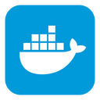

# Verteilte Systeme - Aufgabe 1: CouchDB Microservice


## Einführung

In dieser Dokumentation wird die Entwicklung eines Microservices zur Verwaltung von Geburtstagsdaten innerhalb einer CouchDB-Datenbank beschrieben. Der Microservice stellt eine REST API bereit, die es ermöglicht, Geburtstagsdaten abzurufen und zu filtern.

## Verzeichnisstruktur und wichtige Dateien

Die Struktur für Aufgabe 1 sieht folgendermaßen aus:

```
/Aufgabe1/
│
├── ContainerImage/              # Docker-Kontextverzeichnis für den Microservice
│   ├── config/                   # Konfigurationsdateien für den CouchDB-Container
│   │
│   ├── data/                     # Verzeichnis für CouchDB-Daten
│   │
│   └── Dockerfile                # Dockerfile, um das CouchDB-Image zu bauen
│
├── templates/                    # HTML-Vorlagen für den Microservice
│   └── index.html                # Benutzerfreundlichen Interface für den Microservice
│
├── microservice.py               # Hauptanwendungscode für den Microservice
│
└── .env                          # Umgebungsvariablen für CouchDB

```

## Microservice-Architektur und Funktionsweise

### Komponenten

Der Microservice besteht aus folgenden Hauptkomponenten:

- **FastAPI**: Ein modernes, schnelles Web-Framework für das Erstellen von APIs mit Python. Es bietet automatische interaktive API-Dokumentation und unterstützt asynchrone Anfragen.
- **httpx**: Ein voll funktionsfähiges HTTP-Client für Python, der asynchrone Anfragen ermöglicht und somit eine nicht-blockierende Kommunikation mit der Datenbank erlaubt.

- **dotenv**: Ein Hilfsmodul, um Umgebungsvariablen aus einer `.env`-Datei zu laden. Dies erleichtert die Konfiguration des Services ohne Hardcoding von Werten im Code.

- **Jinja2Templates**: Ein Templating-Tool für Python, mit dem HTML-Seiten dynamisch gerendert werden können. Dies ist nützlich für das Erstellen von Web-Oberflächen.

### Anfrageverarbeitung

Wenn der Service eine Anfrage erhält, verarbeitet FastAPI diese Anfrage durch die entsprechende Route und Funktion:

- **/api/all_data**: Holt alle Dokument-IDs aus der CouchDB und gibt sie zurück.
- **/api/v1/get_data**: Filtert Dokumente basierend auf Monat und Tag.
- **/health**: Überprüft die Gesundheit des Microservices.
- **/**: Zeigt die Startseite des Services an.

### Verarbeitungslogik

- Der Service liest zunächst die Konfiguration aus den Umgebungsvariablen oder verwendet Standardwerte.
- Asynchrone Funktionen kommunizieren mit CouchDB. Bei Anfrageerfolg werden Daten als JSON zurückgegeben.
- Bei Authentifizierungsfehlern oder anderen HTTP-Fehlern fängt der Service die Ausnahmen ab und gibt entsprechende HTTP-Fehlercodes zurück.

### Fehlerbehandlung und Ausgaben

- Bei erfolgreichem Abruf der Daten (`200 OK`) wird eine JSON-Antwort mit den Daten gesendet.
- Bei Authentifizierungsfehlern wird ein `401 Unauthorized` Fehler geworfen.
- Wenn kein passendes Datum gefunden wird, gibt der Service einen `204 No Content` Fehler zurück.
- Bei unerwarteten Problemen, wie Netzwerkfehlern oder ungültigen Anfragen, wird ein `500 Internal Server Error` ausgegeben.

Die asynchrone Natur des Services bedeutet, dass er gleichzeitig mehrere Anfragen bearbeiten kann, ohne dass eine Anfrage die Verarbeitung einer anderen blockiert. Dies ist besonders nützlich für hochlastige Umgebungen, in denen der Service schnell auf eine große Anzahl von Anfragen reagieren muss.

## Umgebungsvariablen und Konfiguration

Die Konfiguration erfolgt durch Umgebungsvariablen, die entweder in einer `.env`-Datei gespeichert oder bei der Bereitstellung übergeben werden. Diese werden dann von dem Microservice verwendet um sich mit der CouchDB-Instanz zu verbinden.

## Containerisierung mit Docker

Die Anwendung wurde containerisiert, um die Bereitstellung zu vereinfachen. Das `Dockerfile` enthält Anweisungen zum Erstellen eines Docker-Images, das alle erforderlichen Abhängigkeiten enthält.

## Lokale Einrichtung und Docker Deployment für CouchDB

Beginnen Sie im Hauptverzeichnis `Abgabe_Abdulaziz`.
Installieren Sie dann die Abhängigkeiten mit `pip install -r requirements.txt`.

Für die Bereitstellung der CouchDB als Docker Container, müssen Sie zunächst in das Unterverzeichnis der Aufgabe 1 und anschließend in den Ordner `ContainerImage` navigieren, der das Dockerfile für CouchDB enthält:

```bash
cd Aufgabe1/ContainerImage
```

### Erstellung des CouchDB Docker-Images

Erstellen Sie das Docker-Image für CouchDB mit dem folgenden Befehl. Dieser Vorgang nutzt das Dockerfile im aktuellen Verzeichnis, um ein neues Docker-Image mit dem Tag `dhbw-couch:1` zu bauen:

```bash
docker build -t dhbw-couch:1 .
```

Dieser Schritt baut das Docker-Image basierend auf den Anweisungen im Dockerfile.

### Starten des CouchDB Containers

Nach dem erfolgreichen Bau des Images starten Sie den CouchDB-Container mit dem folgenden Befehl. Dieser Schritt erzeugt und startet einen neuen Docker-Container namens `couchdb`, der im Hintergrund läuft. Der Port 5984 des Containers wird auf den gleichen Port des Host-Systems gebunden, um die CouchDB erreichbar zu machen:

```bash
docker run -d -p 5984:5984 --name couchdb dhbw-couch:1
```

Testen Sie den Erfolg mit:

```bash
curl -d '{"selector": {"month": "5", "day": "23"}, "fields": ["first","name","prof","year","month","day"], "sort": [{"year":"asc"}]}' -H "Content-Type: application/json" -X POST 'http://localhost:5984/birthday_db/_find' -u 'admin:student'
```

Erwartete Ausgabe:

```json
{
  "docs": [
    {
      "first": "Vinton Gray",
      "name": "Cerf",
      "prof": "Computer Scientist",
      "year": "1943",
      "month": "5",
      "day": "23"
    }
  ],
  "bookmark": "g2wAAAACaAJkAA5zdGFydGtleV9kb2NpZG0AAAAgMTc1NDVhMThmODkwZmZkYmVmODNhZjFiYjcwMDNkMTBoAmQACHN0YXJ0a2V5bAAAAAFtAAAABDE5NDNqag",
  "warning": "The number of documents examined is

high in proportion to the number of results returned. Consider adding a more specific index to improve this."
```

## Starte des Microservices

Nachdem Sie den CouchDB-Container gestartet haben, navigieren Sie zurück in das Verzeichnis, in dem sich der Microservice befindet, um diesen zu starten. Da Sie sich aktuell im Verzeichnis `Aufgabe1/ContainerImage` befinden, gehen Sie mit `cd ..` ein Verzeichnis zurück, um in das Verzeichnis `Aufgabe1` zu gelangen:

```bash
cd ..
```

Starten Sie den Microservice mit folgendem Befehl:

```bash
uvicorn microservice:app --host 0.0.0.0 --port 8000
```

- `uvicorn`: Startet den Uvicorn-Server, einen ASGI-kompatiblen Webserver für Python-Anwendungen.
- `microservice:app`: Der Pfad zur FastAPI-Anwendungsinstanz, wobei `microservice` der Name der Python-Datei (ohne `.py`-Erweiterung) ist und `app` das FastAPI-Anwendungsobjekt innerhalb der Datei bezeichnet.
- `--host 0.0.0.0`: Macht den Server auf allen Netzwerkinterfaces des Hosts verfügbar.
- `--port 8000`: Der Port, auf dem der Server lauscht.

Sobald der Microservice gestartet ist, können Sie ihn über `http://localhost:8000` in Ihrem Webbrowser erreichen, um auf die Startseite zuzugreifen und die Funktionalität des Microservices zu testen.

## Anfragen über Curl

Sie können den Microservice mit `curl` testen, um Geburtstagsdaten abzurufen. Hier sind Beispiele für Anfragen:

- **Abrufen von Daten für einen bestimmten Monat und Tag**:

  ```
  curl "http://localhost:8000/api/v1/get_data?month=12&day=25"
  ```

- **Abrufen aller Daten**:

  ```
  curl "http://localhost:8000/api/all_data"
  ```

Die Antworten von diesen Anfragen werden als JSON-Daten zurückgegeben.

## Interaktive Webseite

Die `index.html` bietet eine benutzerfreundliche Oberfläche für einfache Datenabfragen. Sie können diese Datei im `templates`-Verzeichnis des Projekts finden. Beim Zugriff auf `http://localhost:8000` wird diese HTML-Seite gerendert und angezeigt. Um Daten von der Datenbank abzufragen


---

Nach dem alles getestet wurde entfernen wir wieder den Docker um verwirrungen für Aufgabe zwei zu verwenden.

Zuerst stoppen wir den Container:

```bash
docker stop couchdb
```

und entwernen ihn anschließend:

```bash
docker rm couchdb
```

# Verteilte Systeme - Aufgabe 2: Dockerisierung des Microservices



## Einführung

In Aufgabe 2 geht es darum, den in Aufgabe 1 erstellten Microservice als Docker-Image zu verpacken, um die Anforderungen der 12-Faktor-App zu erfüllen, insbesondere im Hinblick auf die externe Konfiguration. Zudem wird die Nutzung von `.dockerignore` besprochen, um die Effizienz beim Bau von Docker-Images zu steigern.

## Ordnerstruktur und wichtige Dateien

Die Struktur für Aufgabe 2 sieht wie folgt aus:

```
/Aufgabe2/
│
├── .dockerignore            # Datei zum Ausschließen von Dateien aus dem Docker-Context
├── .env                     # Enthält die Umgebungsvariablen für den Container
└── Dockerfile               # Instruktionen zum Erstellen des Docker-Images
```

## Dockerfile für den Microservice

### Inhalt des Dockerfile

Das Dockerfile basiert auf einem offiziellen Python-3.9-slim-Image und führt die folgenden Schritte aus:

1. Setzt das Arbeitsverzeichnis im Container auf `/app`.
2. Kopiert die `requirements.txt` aus dem übergeordneten Verzeichnis und installiert die notwendigen Python-Abhängigkeiten.
3. Kopiert den Code des Microservices aus dem Verzeichnis `Aufgabe1/` in das Arbeitsverzeichnis im Container.
4. Definiert den Befehl zum Starten des FastAPI-Servers.

### Docker Image bauen

Navigieren Sie zum Hauptverzeichnis `Abgabe_Abdulaziz` und führen Sie folgenden Befehl aus:

```bash
docker build -f Aufgabe2/Dockerfile -t microservice_image:latest .
```

### Netzwerk erstellen

Zuerst aber muss ein Docker-Netzwerk erstellt werden, damit die Microservice- und CouchDB-Container miteinander kommunizieren können:

```bash
docker network create birthday_microservice
```

### CouchDB-Container starten

Da bereits ein CouchDB-Image aus Aufgabe 1 existiert, ist es nicht notwendig, ein neues Image für Aufgabe 2 zu erstellen. Stattdessen können wir direkt einen Container mit dem bestehenden Image starten. Starten Sie als nächstes den CouchDB-Container im neu erstellten Netzwerk:

```bash
docker run -d --network birthday_microservice -p 5984:5984 --name couchdb_container dhbw-couch:1
```

### Microservice-Container starten

Nachdem das Netzwerk eingerichtet ist und der CouchDB-Container läuft, können Sie den Microservice-Container starten:

```bash
docker run -d --network birthday_microservice --env-file Aufgabe2/.env -p 8000:8000 --name microservice_container microservice_image:latest
```

Damit die Container kommunizieren können, müssen sie sich im selben Netzwerk befinden und die CouchDB-URL in der `.env`-Datei muss entsprechend angepasst werden.

## Externer Aufruf des Services

Nachdem die Container gestartet wurden, kann der Service über `curl` aufgerufen werden:

```bash
curl "http://localhost:8000/api/v1/get_data?month=12&day=28"
```

## .dockerignore

In der `.dockerignore`-Datei werden alle Dateien und Verzeichnisse aufgeführt, die nicht in den Docker-Context aufgenommen werden sollen. Dadurch wird verhindert, dass unnötige oder sensible Dateien in das Docker-Image gelangen und es wird die Build-Zeit verringert.

# Verteilte Systeme - Aufgabe 3: Kubernetes Deployment


## Einführung zu Kubernetes und Minikube

Kubernetes ist ein mächtiges Open-Source-System zur Automatisierung der Bereitstellung, Skalierung und Verwaltung von containerisierten Anwendungen. Es gruppiert Container, die Teile einer Anwendung bilden, in logische Einheiten für eine einfache Verwaltung und Entdeckung.

Minikube ist ein Tool, das es ermöglicht, Kubernetes lokal auf Ihrem Rechner auszuführen. Es startet eine virtuelle Maschine (VM) und führt darauf einen einfachen Cluster aus. Es ist ideal für Entwickler, die Kubernetes lernen oder täglich damit arbeiten wollen.

`kubectl` ist das Kommandozeilen-Tool, mit dem Sie Cluster verwalten und mit ihnen interagieren können. Es ist das Schweizer Taschenmesser für Kubernetes-Benutzer.

### Installation von kubectl und Minikube

Für macOS können `kubectl` und Minikube mit Homebrew installiert werden:

```bash
brew install kubectl
brew install minikube
```

## Kubernetes-Konfiguration für den Microservice

### Deployment und Service

Ein Kubernetes Deployment managt stateless Anwendungen und stellt sicher, dass eine bestimmte Anzahl von Pod-Replikaten ausgeführt wird. Die Readiness Probe überprüft, ob die Anwendung in den Pods bereit ist, Verkehr zu empfangen.

Ein Kubernetes Service vom Typ NodePort macht einen Service auf jedem Node des Clusters über einen statischen Port erreichbar. Es ermöglicht den externen Zugriff auf den Service.

### Kommunikation zwischen Containern

Innerhalb des Kubernetes-Clusters kommunizieren Container über einen internen Netzwerkprozess, der von Kubernetes verwaltet wird. Services definieren eindeutige DNS-Namen, die innerhalb des Clusters aufgelöst werden. So kann der Microservice-Container beispielsweise auf die CouchDB-Datenbank über den Namen des CouchDB-Services zugreifen, den Sie in der Konfigurationsdatei festgelegt haben.

Durch diese Mechanismen bietet Kubernetes eine nahtlose und sichere Kommunikation zwischen Ihren Services, während es die Komplexität der Netzwerkkonfiguration für Sie handhabt.

### Konfigurationsobjekte

ConfigMaps und Secrets werden verwendet, um Konfigurationseinstellungen und geheime Daten wie Passwörter oder Schlüssel zu speichern. Diese werden dann in den Pods verfügbar gemacht, die vom Deployment verwaltet werden. Mithilfe der base64 Codierung ist es möglich sensible Daten zu codieren.

## Kubernetes-Befehle zum Deployment

### Starten des Minikube-Clusters

`minikube start` ist der Befehl, um Ihren lokalen Kubernetes-Cluster zu starten. Es initiiert die Erstellung einer virtuellen Maschine und installiert einen einfachen Kubernetes-Cluster mit einem einzigen Node.

### Verwendung des Docker-Daemons von Minikube

`eval $(minikube docker-env)` schaltet den lokalen Terminal-Sitzungskontext auf den Docker-Daemon in der Minikube-VM um. Dies bedeutet, dass alle `docker` Befehle, die Sie danach ausführen, Container im Minikube-Cluster und nicht auf Ihrem Host-System erstellen.

### Erstellen der Docker-Images im Minikube-Cluster

```bash
docker build -t microservice-image:latest -f Aufgabe2/Dockerfile .
```

baut ein Docker-Image basierend auf Ihrem `Dockerfile` und benennt es mit dem Tag `latest`. Da Sie `eval $(minikube docker-env)` verwendet haben, wird dieses Image im Docker-Daemon von Minikube erstellt und ist bereit, in Ihrem Cluster verwendet zu werden.

Navigieren Sie zum Dockerfile im Verzeichnis `Aufgabe1` durch folgenden Pfad:

```bash
cd Aufgabe1/ContainerImage
```

Sobald Sie sich im richtigen Verzeichnis befinden, können Sie das Docker-Image mit folgendem Befehl erstellen:

```bash
docker build -t dhbw-couch:1 .
```

Nachdem das Image erstellt wurde, kehren Sie mit dem Befehl zum Hauptverzeichnis zurück:

```bash
cd ../..
```

### Deployment der Anwendung und Datenbank in Kubernetes

Die folgenden `kubectl apply -f` Befehle erstellen oder aktualisieren die Ressourcen in Ihrem Kubernetes-Cluster gemäß den Konfigurationsdateien:

- `kubectl apply -f Aufgabe3/couchdb-deployment.yaml`: Dieser Befehl erstellt ein Deployment für die CouchDB-Datenbank, basierend auf dem Image, das Sie zuvor angegeben haben. Die CouchDB-Datenbank wird als Stateful Service ausgeführt, was bedeutet, dass die Daten persistent gespeichert werden.

- `kubectl apply -f Aufgabe3/couchdb-service.yaml`: Dieser Befehl erstellt einen Kubernetes-Service vom Typ NodePort für die CouchDB. Der Service macht die CouchDB-Instanz über einen festen Port auf dem Host-System des Minikube-Clusters verfügbar.

- `kubectl apply -f Aufgabe3/microservice-config.yaml`: Mit diesem Befehl wird eine ConfigMap erstellt, die Umgebungsvariablen für den Microservice bereitstellt, wie z.B. die URL der CouchDB.

- `kubectl apply -f Aufgabe3/microservice-secret.yaml`: Hiermit erstellen Sie ein Kubernetes Secret, das sensible Daten wie Benutzernamen und Passwörter sicher im Cluster speichert.

- `kubectl apply -f Aufgabe3/microservice-deployment.yaml`: Dieses Kommando startet das Deployment Ihres Microservices. Es stellt sicher, dass eine definierte Anzahl von Replikaten Ihres Microservice-Containers im Cluster läuft.

- `kubectl apply -f Aufgabe3/microservice-service.yaml`: Schließlich erstellt dieser Befehl einen Kubernetes-Service vom Typ NodePort für Ihren Microservice, wodurch er extern über einen spezifischen Port erreichbar wird.

### Pods anzeigen und erwarte Ausgabe

Um alle Pods anzuzeigen und zu überprüfen, ob sie erfolgreich gestartet wurden, führen Sie den Befehl aus:

```bash
kubectl get pods
```

Erwartete Ausgabe:

```plaintext
NAME                                   READY   STATUS    RESTARTS   AGE
couchdb-deployment-<random-string>     1/1     Running   0          1m
microservice-deployment-<random-string> 1/1     Running   0          1m
```

### Externen Zugriff auf den Service

Um den Service extern aufzurufen, nutzen Sie `minikube service`:

```bash
minikube service microservice
```

Dies gibt die URL zurück, über die der Service erreichbar ist.

Durch die Verwendung von `minikube service` können Sie den Service in Ihrem Standardbrowser öffnen und interagieren.
